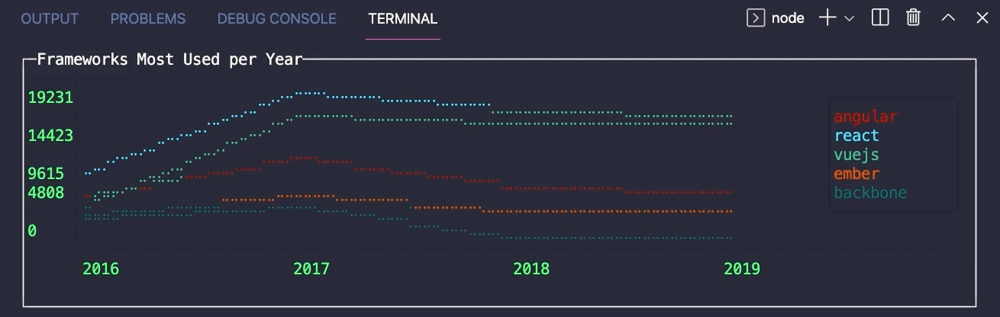

# Handle heavy reporting with stream

Idea: get a source of data (state-of-js.csv), handle the data with stream and show a graph on terminal, using blessed.

## Tasks

- [ ] Load `state-of-js` data;
- [ ] Group data by:
  - year
  - technology;
- [ ] Show graph like:

## References

- [blessed-contrib](https://github.com/yaronn/blessed-contrib) - Build dashboards (or any other application) using ascii/ansi art and javascript. - based on https://github.com/chjj/blessed
- https://www.kaggle.com/sachag/state-of-js-2019
- http://ndjson.org/
- https://itnext.io/streaming-sql-in-node-js-eb419c5bd27e
- https://dev.to/_patrickgod/fetching-millions-of-rows-with-streams-in-node-js-487e
- https://hevodata.com/learn/nodejs-open-source-etl-tools-for-2021/
- https://www.npmjs.com/package/ndjson
- https://stackoverflow.com/questions/48387040/how-do-i-determine-the-correct-max-old-space-size-for-node-js/62650303#62650303